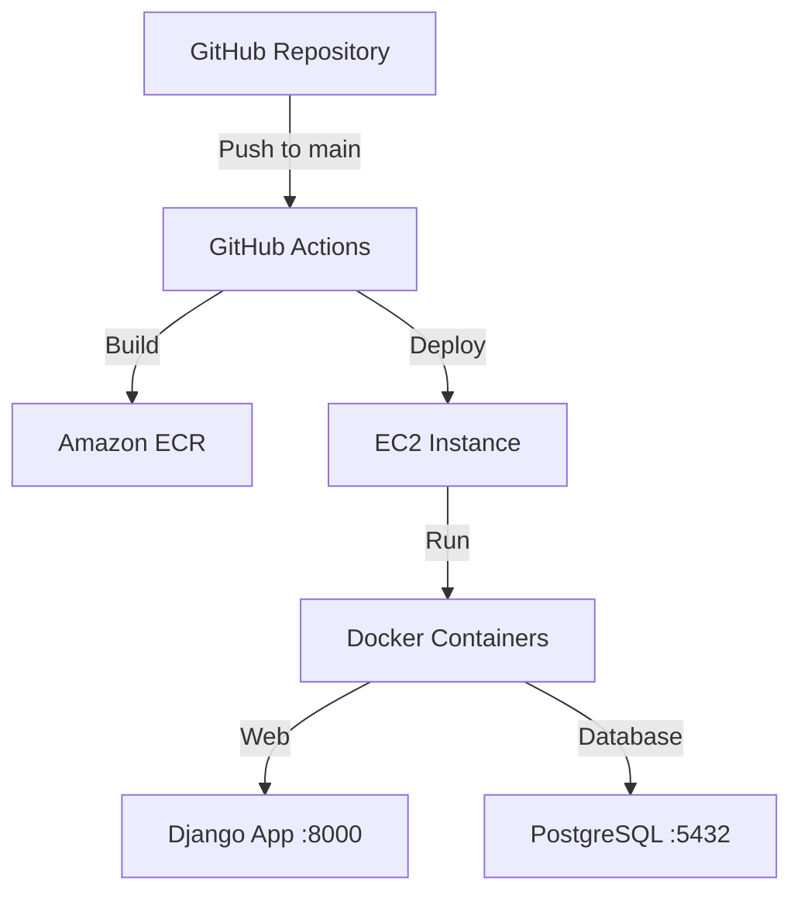

# AWS EC2 Deployment Guide

## Overview
This document outlines the deployment strategy for the RoundReserve backend service to AWS EC2 using Docker containers and a CI/CD pipeline.

## Current Progress

### 1. ✅ Containerize Application
- **Dockerfile Configuration** ✅
  - Base image: python:3.11-slim
  - System dependencies installed for Playwright
  - Python dependencies from requirements.txt
  - Multi-stage build for development and production
  - Location: `docker/Dockerfile`

- **Docker Compose Setup** ✅
  - Development configuration: `docker/docker-compose.yml`
    - Django development server
    - PostgreSQL database
    - Environment variables configured
  - Production configuration: `docker/docker-compose.prod.yml`
    - Gunicorn for production server
    - Nginx reverse proxy
    - Redis for caching
    - PostgreSQL database

### 2. ✅ Amazon ECR Setup
- **Prerequisites**
  - ✅ Configure IAM permissions
    ```json
    {
        "Version": "2012-10-17",
        "PolicyName": "RoundReserveECRAccessPolicy",
        "Statement": [
            {
                "Effect": "Allow",
                "Action": [
                    "ecr:CreateRepository",
                    "ecr:GetAuthorizationToken",
                    "ecr:BatchCheckLayerAvailability",
                    "ecr:GetDownloadUrlForLayer",
                    "ecr:GetRepositoryPolicy",
                    "ecr:DescribeRepositories",
                    "ecr:ListImages",
                    "ecr:DescribeImages",
                    "ecr:BatchGetImage",
                    "ecr:InitiateLayerUpload",
                    "ecr:UploadLayerPart",
                    "ecr:CompleteLayerUpload",
                    "ecr:PutImage",
                    "ecr:PutLifecyclePolicy"
                ],
                "Resource": "*"
            }
        ]
    }
    ```

- **Repository Configuration**
  - ✅ Create ECR repository
    ```bash
    aws ecr create-repository \
      --repository-name roundreserve-backend \
      --image-scanning-configuration scanOnPush=true
    ```
  - ✅ Configure repository permissions (via IAM policy above)
  - ✅ Set up image lifecycle policy (keep last 30 images)
    ```bash
    aws ecr put-lifecycle-policy \
      --repository-name roundreserve-backend \
      --lifecycle-policy-text '{
        "rules": [{
          "rulePriority": 1,
          "description": "Keep last 30 images",
          "selection": {
            "tagStatus": "any",
            "countType": "imageCountMoreThan",
            "countNumber": 30
          },
          "action": {
            "type": "expire"
          }
        }]
      }'
    ```

- **Repository Details**
  - Repository URI: 424029273204.dkr.ecr.us-east-2.amazonaws.com/roundreserve-backend
  - Region: us-east-2
  - Image Tag: latest
  - Scan on Push: Enabled
  - Encryption: AES-256

- **Image Build and Push Process**
  ```bash
  # Authenticate with ECR
  aws ecr get-login-password --region us-east-2 | docker login --username AWS --password-stdin 424029273204.dkr.ecr.us-east-2.amazonaws.com

  # Build production image
  docker build -f docker/Dockerfile --target production -t roundreserve-backend:latest .

  # Tag and push image
  docker tag roundreserve-backend:latest 424029273204.dkr.ecr.us-east-2.amazonaws.com/roundreserve-backend:latest
  docker push 424029273204.dkr.ecr.us-east-2.amazonaws.com/roundreserve-backend:latest
  ```

### 3. ✅ CI/CD Pipeline Implementation
- **GitHub Actions Configuration**
  - ✅ Workflow file: `.github/workflows/ci-cd.yml`
  - ✅ Triggers:
    - Push to main branch
    - Pull requests to main branch
  - ✅ Environment Variables:
    - AWS_REGION: us-east-2
    - ECR_REPOSITORY: roundreserve-backend
    - ECR_REGISTRY: 424029273204.dkr.ecr.us-east-2.amazonaws.com
    - EC2_HOST: 18.118.64.130

- **Required Secrets**
  ```bash
  # GitHub Repository Secrets
  AWS_ACCESS_KEY_ID=<aws-access-key-id>
  AWS_SECRET_ACCESS_KEY=<aws-secret-access-key>
  EC2_SSH_KEY=<contents-of-roundreserve-github-actions-key.pem>
  ```

- **SSH Keys**
  - Development Key: `roundreserve-backend-key` (for manual SSH access)
  - GitHub Actions Key: `roundreserve-github-actions-key` (for automated deployments)

- **Pipeline Stages**
  1. Test Stage
     - Runs Python tests in isolated environment
     - Uses PostgreSQL service container
     - Validates code quality and functionality

  2. Build and Deploy Stage (on main branch only)
     - Configures AWS credentials
     - Logs in to Amazon ECR
     - Builds production Docker image
     - Tags image with commit SHA and latest
     - Pushes images to ECR
     - Deploys to EC2 using SSH

- **Manual Deployment**
  If needed, you can still deploy manually using:
  ```bash
  ./scripts/deploy.sh
  ```

### 4. ✅ EC2 Instance Preparation
- **System Configuration**
  - ✅ Docker installed and configured
  - ✅ Security groups configured
    - Port 80 (HTTP)
    - Port 443 (HTTPS)
    - Port 22 (SSH)
  - ✅ Instance Details
    - Instance ID: i-0bbbbbd92e9df7d13
    - Public IP: 18.118.64.130
    - Security Group: sg-0db527c9644935eb4

- **Deployment Configuration**
  - ✅ Production docker-compose file
    - Location: `docker/docker-compose.prod.yml`
    - Services:
      - Web (Django application)
      - PostgreSQL database
  
  - ✅ Deployment script
    - Location: `scripts/deploy.sh`
    - Features:
      - ECR authentication
      - Image pulling
      - Container orchestration
      - Cleanup of old images

### 5. ✅ Application Status
- **Deployment Verification (2024-02-12)**
  - ✅ Application containers running successfully
  - ✅ Database connection established
  - ✅ API endpoints responding:
    - `/api/health/` - Returns 200 OK with status
    - `/api/run-browserbase/` - Properly configured for POST requests
  - ✅ Environment variables properly configured
  - ✅ SSH-based deployment working
  - ⚠️ HTTPS configuration pending (currently HTTP only)

### 6. 🔄 Next Steps
1. SSL/HTTPS Configuration
   - Set up SSL certificates
   - Configure Nginx for HTTPS
   - Update security groups if needed

2. Monitoring Setup
   - Configure CloudWatch logs
   - Set up performance monitoring
   - Implement alerting

3. Backup Strategy
   - Database backup configuration
   - Automated backup scheduling
   - Backup retention policy

### 7. ✅ HTTPS Configuration (Completed)
- **Current Progress**
  1. ✅ Infrastructure Information Gathered
     - VPC ID: vpc-02c9de75282878da6
     - Primary Subnet: subnet-04a5147dcb3871ed5 (us-east-2a)
     - Secondary Subnet: subnet-06875f48651caa820 (us-east-2b)
     - Security Group: sg-0f0ceb2d62970cd1c

  2. ✅ SSL Certificate Configured
     - Certificate ARN: arn:aws:acm:us-east-2:424029273204:certificate/29d39827-c32d-4c3a-beb6-2714115d90a5
     - Validation Method: DNS
     - Status: ISSUED
     - Domain: api.paragonai.club

  3. ✅ Load Balancer Setup
     - Name: roundreserve-backend-alb
     - DNS Name: roundreserve-backend-alb-1043139422.us-east-2.elb.amazonaws.com
     - ARN: arn:aws:elasticloadbalancing:us-east-2:424029273204:loadbalancer/app/roundreserve-backend-alb/02ed3a9e6e2903da
     - Hosted Zone ID: Z3AADJGX6KTTL2
     - HTTPS Listener: Port 443
     - Target Group: roundreserve-backend-tg
     - Health Check Path: /api/health/

  4. ✅ DNS Configuration
     - Hosted Zone ID: Z05058843K2CF68ZKZWFN
     - A Record: api.paragonai.club → ALB
     - Certificate Validation: Complete
     - DNS Propagation: In Progress

- **Verification Steps**
  1. Wait for DNS propagation (usually 5-10 minutes)
  2. Test HTTPS endpoint:
     ```bash
     curl https://api.paragonai.club/api/health/
     ```
  3. Monitor target group health:
     ```bash
     aws elbv2 describe-target-health \
       --target-group-arn arn:aws:elasticloadbalancing:us-east-2:424029273204:targetgroup/roundreserve-backend-tg/3e7df219d05cedfc
     ```

## Recent Updates (2024-02-12)
1. ✅ Successfully deployed application with SSH-based authentication
2. ✅ Verified all containers running properly
3. ✅ Confirmed API endpoints functioning
4. ✅ Database connection established
5. ✅ Environment variables correctly loaded
6. ✅ Deployment script working as expected

## Current Architecture


## Verified Endpoints
| Endpoint | Method | Status | Description |
|----------|---------|---------|-------------|
| `/api/health/` | GET | ✅ Working | Returns application health status |
| `/api/run-browserbase/` | POST | ✅ Configured | Browserbase integration endpoint |

## Environment Configuration
- ✅ Production environment variables set
- ✅ AWS credentials configured
- ✅ Database credentials secured
- ✅ API keys properly stored

## Known Issues and Solutions
1. ⚠️ HTTPS Not Configured
   - Currently running on HTTP only
   - SSL certificate setup pending
   - Nginx configuration needed for HTTPS

2. 🔄 Load Balancer
   - Not yet implemented
   - Required for high availability
   - Planned for future scaling

## Deployment Commands
```bash
# Verify deployment status
curl http://localhost:8000/api/health/
# Expected response: {"status":"healthy"}

# Check running containers
docker ps
# Should show web and database containers

# View logs
docker logs docker-web-1
```

## Security Considerations
- Secure storage of environment variables
  - Use .env.production for production values
  - Never commit .env or .env.production files
  - Store sensitive values in AWS Secrets Manager (future enhancement)
- Regular security updates and patches
- Network access restrictions
- SSL/TLS certificate management
- IAM role-based access control

## Monitoring and Maintenance
- CloudWatch logs and metrics
- Application performance monitoring
- Database backup procedures
- Container health checks
- Resource utilization tracking

## Rollback Procedures
- Version control for Docker images
- Database rollback strategies
- Load balancer configuration backups
- Emergency rollback procedures

## Future Considerations
- Scaling strategies
- High availability setup
- Disaster recovery planning
- Performance optimization
- Cost optimization strategies

## Implementation Log
- **2024-02-12**
  - ✅ Organized Docker files into `docker/` directory
  - ✅ Configured multi-stage Dockerfile for dev/prod
  - ✅ Set up development and production docker-compose files
  - ✅ Tested local development environment
  - ✅ Created ECR repository and configured lifecycle policy
  - ✅ Successfully built and pushed first production image to ECR
  - ✅ Created production docker-compose configuration
  - ✅ Created deployment script
  - ✅ Configured EC2 security groups
  - ✅ Implemented CI/CD pipeline with GitHub Actions
  - ✅ Created and configured GitHub Actions SSH key
  - ❌ Fixed Git authentication issues
  - ❌ Fixed environment file configuration
  - ❌ Updated deployment documentation with troubleshooting steps
  - ✅ Created and attached RoundReserveHTTPSSetupPolicy for HTTPS setup
  - ✅ Created and validated SSL certificate
  - ✅ Configured Application Load Balancer
  - ✅ Set up target group with health checks
  - ✅ Added HTTPS listener
  - ✅ Updated DNS records
  - ⏳ Waiting for DNS propagation
