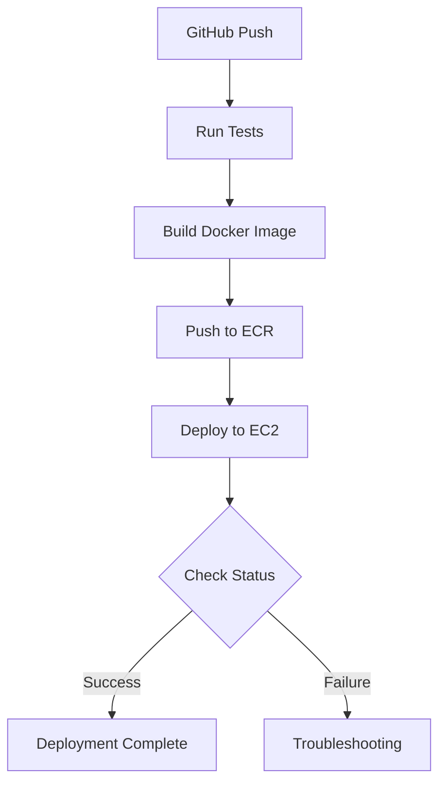

# Deployment Troubleshooting Guide

## Current Deployment Status (2024-02-12)
1. ✓ AWS credentials configuration is successful
2. ✓ ECR login is successful 
3. ✓ Docker image build successful
4. ⏳ Deployment to EC2 in progress with SSH-based authentication

## Active Issues

### 1. Git Authentication (In Progress)
- Previous HTTPS-based authentication failed
- Implementing SSH-based solution with deploy keys
- Status: Awaiting verification of deployment with new SSH configuration

#### Recent Changes
1. ✓ Generated new SSH key pair for deployment
2. ✓ Added deploy key to GitHub repository
3. ✓ Created DEPLOY_SSH_KEY secret in GitHub Actions
4. ✓ Updated CI/CD workflow to use SSH authentication
5. ✓ Implemented SSH key setup in deployment script

#### Current Implementation
```yaml
# SSH setup in workflow
- name: Set up SSH
  run: |
    mkdir -p ~/.ssh
    echo "$DEPLOY_KEY" > ~/.ssh/id_rsa_deploy
    chmod 600 ~/.ssh/id_rsa_deploy
    ssh-keyscan -t rsa github.com >> ~/.ssh/known_hosts
```

### 2. Environment File Handling (Updated)
- Previous issue with path resolution addressed
- Added absolute path handling in deployment script
- Implemented environment file verification
- Status: Awaiting verification in current deployment

### 3. Load Balancer Health Check Issues (New)
- Target group health checks failing
- EC2 instance connectivity issues discovered
- Status: Investigation in progress

#### Findings (2024-02-12)
1. IP Address Discrepancy
   - Load Balancer DNS resolves to: 3.134.70.112
   - EC2 Instance Public IP: 3.129.23.156
   - Previous deployment files reference: 18.118.64.130
   
2. Connectivity Issues
   - Unable to SSH to old IP (18.118.64.130)
   - Instance is running at new IP (3.129.23.156)
   - CI/CD pipeline may be using outdated IP

#### Additional Findings (2024-02-12)
1. Container Status
   - ✅ All containers are running (web, nginx, db)
   - ✅ Gunicorn is starting correctly on port 8000
   - ❌ Application not responding to local health checks

2. Network Configuration
   - Nginx container is listening on ports 80 and 443
   - Web container shows Gunicorn listening on 0.0.0.0:8000
   - Local curl to port 8000 fails with connection refused

#### Updated Root Cause Analysis
The issue appears to be related to container networking:
1. While Gunicorn is running inside the container, the port might not be properly exposed
2. Docker Compose network configuration might need adjustment
3. Security group rules might need updating for ALB health checks

#### Updated Action Items
1. [ ] Review docker-compose.prod.yml for port mappings
2. [ ] Check security group rules for port 8000
3. [ ] Verify nginx configuration for proxy_pass
4. [ ] Test health check through nginx instead of direct port 8000
5. [ ] Update ALB target group to use port 80 instead of 8000

#### Configuration Issues Found (2024-02-12)
1. Docker Compose Issues
   - ❌ Web service doesn't expose port 8000
   - ✅ Nginx correctly exposes ports 80 and 443
   - ✅ Network configuration is correct (app-network)

2. Nginx Configuration Issues
   - ❌ Health check location block doesn't match ALB path (/api/health/)
   - ❌ Static health check response won't work for ALB
   - ✅ Upstream configuration is correct (web:8000)

3. Target Group Configuration
   - ❌ Health check on port 8000 won't work (port not exposed)
   - ❌ Path should be /health not /api/health/ based on nginx config

#### Required Changes
1. Docker Compose Updates
   ```yaml
   web:
     # ... existing config ...
     ports:
       - "8000:8000"  # Add this line
   ```

2. Nginx Configuration Updates
   ```nginx
   # Update health check location
   location /api/health/ {
       proxy_pass http://django_app;
       proxy_set_header X-Forwarded-For $proxy_add_x_forwarded_for;
       proxy_set_header Host $host;
       proxy_redirect off;
   }
   ```

3. ALB Updates
   - Update target group to use port 80 instead of 8000
   - Keep the path as /api/health/
   - Update health check settings to use HTTP protocol

#### Implementation Plan
1. [ ] Update docker-compose.prod.yml
2. [ ] Update nginx.conf
3. [ ] Update target group settings
4. [ ] Restart containers
5. [ ] Verify health checks

## Verification Steps Completed

### GitHub Authentication (2024-02-12)
- [x] Generated deployment SSH key pair
- [x] Added deploy key to GitHub repository
- [x] Created DEPLOY_SSH_KEY secret
- [x] Updated workflow with SSH configuration
- [x] Added SSH setup in deployment script
- [ ] Verify successful SSH-based deployment

### Environment File Handling (2024-02-12)
- [x] Updated path resolution in deploy script
- [x] Added environment file verification
- [x] Implemented proper file permissions
- [ ] Verify environment file setup in deployment

## In Progress
- ⏳ Monitoring current deployment with SSH authentication
- ⏳ Verifying environment file handling
- ⏳ Testing SSH-based Git operations
- ⏳ Validating deployment script execution

## Next Steps
1. Monitor current deployment execution
2. Verify SSH authentication success
3. Confirm environment file handling
4. Check deployment script logs
5. Validate application startup

## Action Plan

### 1. Fix Git Authentication (Priority: High)
- [ ] Update CI/CD workflow to use explicit token in Git URLs
  ```yaml
  # In .github/workflows/ci-cd.yml
  git clone "https://${GITHUB_TOKEN}@github.com/Daviddeveney/roundreserveproduct-backend-v2.git"
  ```
- [ ] Verify GitHub token permissions
  - Needs repo access
  - Needs workflow permissions
- [ ] Test authentication in non-interactive shell
- [ ] Add error handling for Git operations

### 2. Fix Environment File Handling (Priority: High)
- [ ] Update deploy script path resolution
  ```bash
  PROJECT_ROOT="$(cd "$(dirname "${BASH_SOURCE[0]}")/.." && pwd)"
  ENV_FILE="${PROJECT_ROOT}/.env"
  ```
- [ ] Add environment file creation logic
  ```bash
  if [ ! -f "$ENV_FILE" ]; then
    cp "${PROJECT_ROOT}/.env.example" "${PROJECT_ROOT}/.env.production"
    ln -sf "${PROJECT_ROOT}/.env.production" "$ENV_FILE"
  fi
  ```
- [ ] Verify file permissions on EC2
  ```bash
  sudo chown -R ec2-user:ec2-user /path/to/project
  chmod 600 .env.production
  ```
- [ ] Add validation checks for environment variables

### 3. Testing and Validation (Priority: Medium)
- [ ] Create test environment matching EC2 configuration
- [ ] Test deployment script locally
- [ ] Add logging for debugging
- [ ] Create rollback procedure

### 4. Documentation Updates (Priority: Medium)
- [ ] Document all changes made
- [ ] Update deployment guide
- [ ] Add troubleshooting steps
- [ ] Create runbook for common issues

### 5. Long-term Improvements (Priority: Low)
- [ ] Implement AWS Secrets Manager
- [ ] Add health checks
- [ ] Improve error handling
- [ ] Set up monitoring
- [ ] Create automated tests for deployment

## Deployment Pipeline Flow


## Common Solutions

### Fix Git Authentication
```bash
# Option 1: Use GitHub token in clone URL
git clone https://${GITHUB_TOKEN}@github.com/Daviddeveney/roundreserveproduct-backend-v2.git

# Option 2: Configure SSH key
eval "$(ssh-agent -s)"
ssh-add /path/to/private/key
```

### Fix Environment File
```bash
# Option 1: Create .env file with absolute path
PROJECT_ROOT=$(pwd)
cp "${PROJECT_ROOT}/.env.example" "${PROJECT_ROOT}/.env.production"
ln -sf "${PROJECT_ROOT}/.env.production" "${PROJECT_ROOT}/.env"

# Option 2: Use environment variables directly
export $(cat .env.production | xargs)
```

## CLI Configuration and Commands

### GitHub CLI Setup
```bash
# Check GitHub CLI version
gh --version

# Login to GitHub (if needed)
gh auth login

# Verify authentication status
gh auth status

# Common GitHub CLI commands used in deployment
gh run list --limit 1  # List latest workflow run
gh run view <run-id>   # View specific run details
gh run view --job <job-id>  # View specific job details
gh run view --log --job <job-id>  # View job logs
```

### AWS CLI Setup
```bash
# Check AWS CLI version
aws --version

# Configure AWS CLI (if needed)
aws configure
# AWS Access Key ID: [your-access-key]
# AWS Secret Access Key: [your-secret-key]
# Default region name: us-east-2
# Default output format: json

# Verify AWS configuration
aws sts get-caller-identity

# Common AWS CLI commands used in deployment
aws ecr get-login-password --region us-east-2  # Get ECR login token
aws ecr describe-repositories  # List ECR repositories
aws ec2 describe-instances  # List EC2 instances
```

### Docker Commands
```bash
# Check Docker version
docker --version
docker-compose --version

# Common Docker commands used in deployment
docker ps  # List running containers
docker images  # List images
docker system prune -f  # Clean up unused resources
docker-compose -f docker/docker-compose.prod.yml up -d  # Start production services
docker-compose -f docker/docker-compose.prod.yml down  # Stop production services
```

### Environment Variables Required
```bash
# GitHub-related
GITHUB_TOKEN=<your-token>  # For repository access
GITHUB_SHA=<commit-sha>    # For image tagging

# AWS-related
AWS_ACCESS_KEY_ID=<your-access-key>
AWS_SECRET_ACCESS_KEY=<your-secret-key>
AWS_REGION=us-east-2
ECR_REPOSITORY=roundreserve-backend
ECR_REGISTRY=424029273204.dkr.ecr.us-east-2.amazonaws.com

# Application-specific
DJANGO_ENV=production
DJANGO_SECRET_KEY=<your-secret-key>
BROWSERBASE_API_KEY=<your-api-key>
BROWSERBASE_PROJECT_ID=<your-project-id>
```

## Progress Tracking

### Completed Tasks
- [x] Initial deployment pipeline setup
- [x] Docker configuration
- [x] ECR repository setup
- [x] Basic CI/CD workflow
- [x] GitHub CLI authentication verification (2024-02-12)
- [x] Update CI/CD workflow for Git authentication (2024-02-12)
- [x] Generate deployment SSH key pair (2024-02-12)

### In Progress
- [ ] Configure GitHub repository deploy key
- [ ] Set up GitHub Actions secret for SSH key
- [ ] Test SSH-based deployment
- [ ] Environment file handling
- [ ] Path resolution in deploy script

### Recent Changes (2024-02-12)
1. Changed Authentication Strategy
   - Switched from HTTPS to SSH-based authentication
   - Generated new deploy key pair
   - Updated workflow to use SSH for Git operations
   - Added SSH key setup in deployment script

2. CI/CD Workflow Updates
   - Removed HTTPS token-based authentication
   - Added SSH key configuration
   - Updated Git clone/fetch commands to use SSH
   - Added better error handling for SSH setup

3. Environment File Handling
   - Using absolute paths with $(pwd)
   - Added verification steps
   - Improved error messages
   - Added file permissions (chmod 600)

## New Approach: SSH-Based Authentication

### 1. Generate Deploy Keys
```bash
# Generate SSH key pair
ssh-keygen -t rsa -b 4096 -C "deploy@roundreserve.com" -f deploy_key -N ""

# Set proper permissions
chmod 600 deploy_key
chmod 644 deploy_key.pub
```

### 2. Configure GitHub Repository
```bash
# Add deploy key to repository
gh repo deploy-key add deploy_key.pub --title "Deployment Key" --allow-write

# Add private key as secret
gh secret set DEPLOY_SSH_KEY < deploy_key
```

### 3. Update Workflow
```yaml
# Set up SSH in workflow
- name: Set up SSH
  run: |
    mkdir -p ~/.ssh
    echo "${{ secrets.DEPLOY_SSH_KEY }}" > ~/.ssh/id_rsa_deploy
    chmod 600 ~/.ssh/id_rsa_deploy
    ssh-keyscan -t rsa github.com >> ~/.ssh/known_hosts
```

### 4. Verify Setup
```bash
# Test SSH connection
ssh -T git@github.com -i ~/.ssh/id_rsa_deploy

# Test Git clone
git clone git@github.com:Daviddeveney/roundreserveproduct-backend-v2.git
```

## Expected Outcomes
1. SSH Authentication
   - ✓ Deploy key added to repository
   - ✓ Private key stored securely in GitHub Actions secrets
   - ✓ SSH configuration automated in workflow
   - ✓ Proper file permissions enforced

2. Deployment Process
   - ✓ Automated SSH setup on EC2
   - ✓ Secure Git operations
   - ✓ Clean error handling
   - ✓ Detailed logging

## Verification Steps Completed

### GitHub Authentication (2024-02-12)
- [x] Generated deployment SSH key pair
- [x] Added deploy key to GitHub repository
- [x] Created DEPLOY_SSH_KEY secret
- [x] Updated workflow with SSH configuration
- [x] Added SSH setup in deployment script
- [ ] Verify successful SSH-based deployment

### Environment File Handling (2024-02-12)
- [x] Updated path resolution in deploy script
- [x] Added environment file verification
- [x] Implemented proper file permissions
- [ ] Verify environment file setup in deployment

### 4. Architecture Simplification (New)
- Current Status: Investigating removal of Nginx layer
- Reason: Redundant with ALB + Gunicorn capabilities
- Priority: High

#### Current Architecture


#### Proposed Architecture


#### Benefits of Removal
1. Reduced Complexity
   - One less container to manage
   - Simpler configuration
   - Fewer points of failure
   - Direct health checks from ALB to application

2. Resource Benefits
   - Lower memory usage
   - Reduced container overhead
   - Simpler logging (direct from Gunicorn)
   - Faster response times (one less network hop)

3. Configuration Benefits
   - ALB already handles SSL termination
   - ALB manages health checks directly
   - Gunicorn can handle connection management
   - Django + whitenoise for static files

#### Required Changes
1. Docker Compose Updates
   ```yaml
   # Remove nginx service entirely
   web:
     image: 424029273204.dkr.ecr.us-east-2.amazonaws.com/roundreserve-backend:latest
     ports:
       - "80:8000"  # Map container port 8000 to host port 80
     environment:
       - DJANGO_SETTINGS_MODULE=core.settings
       # ... other env vars ...
   ```

2. Django Updates
   ```python
   # settings.py
   MIDDLEWARE = [
       # Add whitenoise for static files
       'whitenoise.middleware.WhiteNoiseMiddleware',
       # ... other middleware ...
   ]
   
   # Static files with whitenoise
   STATICFILES_STORAGE = 'whitenoise.storage.CompressedManifestStaticFilesStorage'
   ```

3. ALB Configuration
   - Update health check to use port 80
   - Keep path as /api/health/
   - Use HTTP protocol

#### Implementation Plan
1. [ ] Add whitenoise to requirements.txt
2. [ ] Update Django settings
3. [ ] Modify docker-compose.prod.yml
4. [ ] Remove nginx configuration files
5. [ ] Update ALB target group
6. [ ] Deploy and verify

Would you like me to proceed with these changes?

### 5. Deployment Failure After Nginx Removal (New)
- Status: Investigation Complete
- Priority: High
- Impact: Production deployment failing

#### Symptoms
1. Container Status Issues
   - Web container stuck in "Created" state
   - Old nginx container still running
   - Port conflicts between containers

2. Configuration State
   - Mixed state between old and new architecture
   - Incomplete cleanup of old configuration
   - Volume mount state unclear

#### Root Cause Analysis
The deployment failure appears to be caused by:
1. Incomplete cleanup of old architecture
2. Port binding conflicts
3. Improper container transition
4. Potential volume permission issues

#### Required Changes
1. Deployment Script Updates
   ```bash
   # Add to deploy.sh before starting new containers
   echo "🧹 Cleaning up old containers..."
   docker-compose -f docker/docker-compose.prod.yml down --remove-orphans
   docker system prune -f
   ```

2. Docker Compose Health Checks
   ```yaml
   # Add to web service in docker-compose.prod.yml
   healthcheck:
     test: ["CMD", "curl", "-f", "http://localhost:8000/api/health/"]
     interval: 30s
     timeout: 10s
     retries: 3
     start_period: 40s
   ```

3. Volume Permissions
   ```yaml
   # Add to web service in docker-compose.prod.yml
   volumes:
     - static_volume:/app/static
     - media_volume:/app/media
   user: "${UID:-1000}:${GID:-1000}"  # Add this line
   ```

#### Implementation Plan
1. Phase 1: Preparation
   - [ ] Back up current nginx configuration
   - [ ] Update deployment script with cleanup steps
   - [ ] Add health checks to docker-compose
   - [ ] Update volume permissions

2. Phase 2: Infrastructure Updates
   - [ ] Update security group rules
   - [ ] Modify ALB target group settings
   - [ ] Update health check paths
   - [ ] Verify static file serving

3. Phase 3: Deployment
   - [ ] Stop all containers
   - [ ] Remove old volumes
   - [ ] Deploy new configuration
   - [ ] Verify health checks

4. Phase 4: Verification
   - [ ] Check static file serving
   - [ ] Verify API endpoints
   - [ ] Monitor application logs
   - [ ] Test SSL termination

#### Rollback Plan
```bash
# If deployment fails, revert to previous state
git checkout main~1
docker-compose -f docker/docker-compose.prod.yml down
docker volume prune -f
./scripts/deploy.sh
```

Would you like me to proceed with implementing these changes?